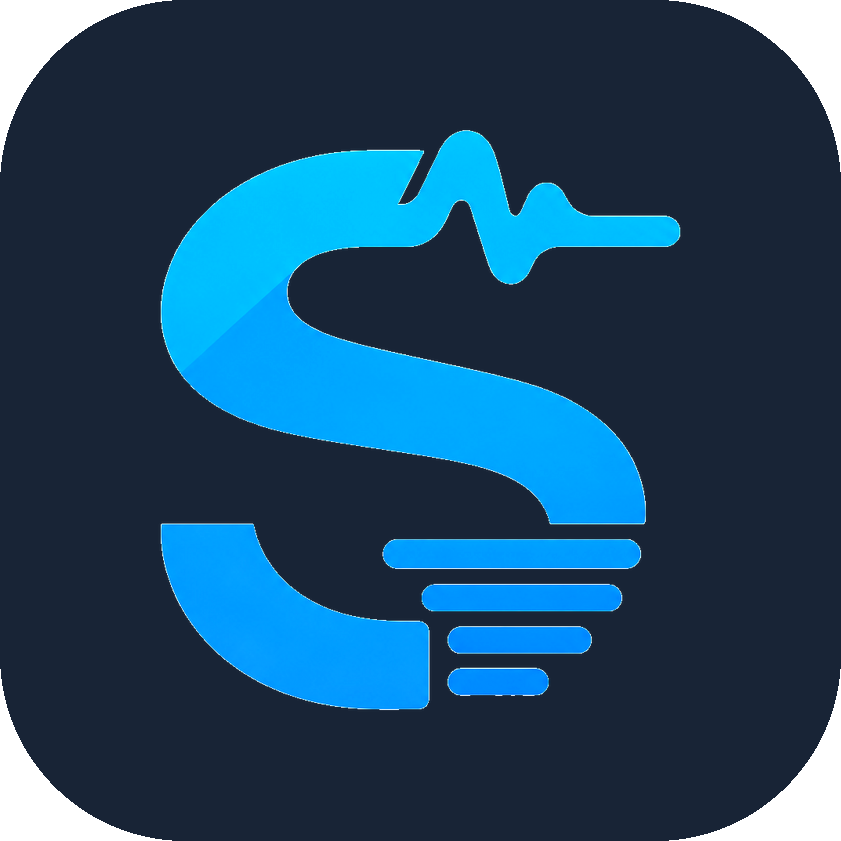

<div align="center">



# SysAudio-Scribe

**Transcribe what your computer is playing, straight into a Notion-style editor.**

[](https://github.com/jodpacharapon/SysAudio-Scribe/actions/workflows/ci.yml)
[](https://github.com/jodpacharapon/SysAudio-Scribe/releases)
[](LICENSE)

</div>

Captures **system audio** — the sound coming out of your speakers, not your microphone — and turns it into text blocks as you listen. Meeting calls, videos, anything playing. Your mic can be mixed in too, but it is off by default.

Speech-to-text runs through OpenAI or OpenRouter; an optional clean-up pass runs through Google Gemini. Windows only for now: loopback capture needs WASAPI.

> **Please read [Privacy](#privacy) before recording.** This app records audio and sends it to third-party APIs.

## Download

Grab the installer from [Releases](https://github.com/jodpacharapon/SysAudio-Scribe/releases). It installs per-user and needs no admin rights.

The build is unsigned, so Windows SmartScreen will warn the first time: choose **More info -> Run anyway**. If you would rather not, [build it yourself](#build) — the result is the same binary.

## Running from source

```bash
npm install
npm run dev
```

On first launch the Settings panel opens. Pick a provider and paste its API key. The key is encrypted with the OS keystore (DPAPI on Windows) and written to `%APPDATA%/sysaudio-scribe/settings.json` — never in plaintext, never in the renderer.

For development you may instead export `OPENAI_API_KEY` or `OPENROUTER_API_KEY`; a stored key always wins.

## Providers

Both providers expose the same OpenAI-shaped multipart transcription API, so only the URL and headers differ.

| | OpenAI | OpenRouter |
|---|---|---|
| Endpoint | `api.openai.com/v1/audio/transcriptions` | `openrouter.ai/api/v1/audio/transcriptions` |
| Key prefix | `sk-` | `sk-or-` |
| Models | `gpt-4o-transcribe`, `gpt-4o-mini-transcribe`, `whisper-1` | those three, plus `openai/whisper-large-v3` and `openai/whisper-large-v3-turbo` |

Keys are stored **per provider**, so switching the picker never sends the wrong credential.

### Model lists are fetched, not hardcoded

Settings has a **Fetch models** button next to each model picker. It asks the
provider what it serves right now, using the key in the box — you do not have to
save it first.

This exists because a baked-in list rots fast. `gemini-1.5-*` and `gemini-2.5-*`
were each the recommended default and each retired within about a year, and an
app that only knows the ids it shipped with will keep sending a model the
provider has already dropped.

| Target | Source | Filter |
|---|---|---|
| OpenAI | `GET /v1/models` | ids matching `transcribe` or `whisper` |
| OpenRouter | `GET /api/v1/models` | same, merged with the hand-verified list |
| Gemini | `GET /v1beta/models` | models declaring `generateContent` |

Only Gemini states capability outright. The other two return one flat list for
every endpoint, so the id is the only signal available — the filter errs towards
showing too much, because an unusable id produces a clear API error while an
over-tight filter would silently hide a model that works.

Any non-empty model id is accepted and stored. The one rule still enforced is
that OpenAI rejects `openai/`-prefixed routing ids, which fails every time.

### When a model is retired

Two things stop a pinned default from rotting silently:

- **The fallback learns.** The last list each provider returned is kept in
  `settings.json` and offered ahead of the built-in list, which is frozen the day
  the app is built. The picker says which of the three it is showing — live,
  cached, or built-in — so a stale list is never mistaken for a current one.
- **A dead model says so.** A 404, an OpenRouter `does not exist`, or an OpenAI
  `model_not_found` is turned into *"Model X is no longer available. Open
  Settings, press Fetch models, and pick a current one."* rather than a raw
  status code.

The polish pass is the place this used to hide: every chunk failing would leave
each chunk's raw text in place, so a dead model produced a "polished" transcript
identical to the original with nothing to explain it. Partial failures still
keep what succeeded, but a pass where *every* chunk failed now raises.

Two things worth knowing about OpenRouter's transcription endpoint, both verified against the live API:

- It serves **only the OpenAI model family**. `openai/gpt-audio`, `google/gemini-*` and `mistralai/voxtral-*` appear in the `/models` catalogue but are rejected here with `Model ... does not exist`.
- `whisper-1` bills per second; the `gpt-4o-*` models bill per token.
- The `openai/`-prefixed Whisper Large V3 ids are **OpenRouter-only routing ids**. OpenAI's own API rejects the prefixed form, so they are not offered under the OpenAI provider.

Note that `whisper-1` is Whisper **large-v2**, not v3. To actually run Whisper Large V3, pick OpenRouter and one of the `openai/whisper-large-v3*` ids.

## Platform support

| Platform | System audio |
|---|---|
| Windows | Works out of the box (WASAPI loopback) |
| macOS | Requires a virtual audio device (BlackHole, Loopback) |
| Linux | Depends on the PipeWire/PulseAudio portal |

## The data flow, end to end

```
[1] User clicks Record
         │  renderer
         ▼
[2] navigator.mediaDevices.getDisplayMedia({ video: true, audio: true })
         │
         │  Electron has no built-in picker, so this call is answered by
         │  our own handler in the MAIN process:
         │
         ├──► setDisplayMediaRequestHandler(...) ──► callback({ video: screen, audio: 'loopback' })
         │    src/main/audio-capture.ts
         │
         │  'loopback' taps the OS audio *render* endpoint. No screen-share
         │  dialog appears, which is what makes this a background capture.
         ▼
[3] Renderer immediately stops + removes the video track.
    Only the audio track survives.  → MediaStream(audio only)
         │
         ▼
[4] Rolling segment recorder — src/renderer/src/hooks/useSystemAudioRecorder.ts

    every 30s:  new MediaRecorder(stream) → start() → stop()
                          │
                          └─ onstop ─► one COMPLETE .webm Blob
                                       └─► immediately starts the next recorder

    Why restart instead of MediaRecorder.start(30_000) with timeslices?
    Timeslices emit headerless fragments. Only the first chunk carries the
    WebM header, so chunks 2..n cannot be decoded standalone and the API
    rejects them. Restarting gives every segment its own header.

    Segments smaller than 6 KB are dropped — Opus encodes silence almost
    for free, so a tiny segment is dead air and not worth a paid API call.
         │
         │  Blob + sequence number
         ▼
[5] TranscriptionQueue — src/renderer/src/lib/transcription-queue.ts

    Uploads are serialised. Parallel uploads would finish out of order and
    scramble the transcript. Recording runs on its own timer regardless of
    how far behind the queue is, so a slow network delays text but never
    drops audio.
         │
         │  IPC: { sequence, audio: ArrayBuffer, mimeType }
         ▼
[6] MAIN process — src/main/transcription.ts

    Buffer → multipart/form-data:
        file     = segment.webm
        model    = gpt-4o-transcribe
        language = th          ← pinning this stops the model guessing
        prompt   = <your jargon> + <tail of the previous segment>

    POST → the endpoint for the selected provider (OpenAI or OpenRouter).
    Retries 429/5xx with exponential backoff. 401 fails immediately.

    The API key lives ONLY here. The renderer never sees it, so an XSS in
    the editor cannot exfiltrate it.
         │
         │  IPC reply: { ok: true, sequence, text }
         │  Failures are returned as VALUES, not thrown — one bad segment
         │  must never stop an in-progress recording.
         ▼
[7] Renderer strips the words duplicated by the segment overlap, then
    appends the text as a new BlockNote paragraph block.
    src/renderer/src/lib/overlap.ts, src/renderer/src/lib/editor-append.ts

    A fresh document already holds one empty paragraph, so the first
    segment REPLACES it rather than inserting after it.
         │
         ▼
[8] On stop, optionally polish the whole transcript with Gemini.
    src/main/transcription.ts → rewriteTranscript()

    Runs once on the finished text, never per segment: a 20-second
    fragment is the one unit where the model cannot tell how the
    sentence started, so polishing it produces confident nonsense.
```

### Segment overlap

Each segment keeps recording for `SEGMENT_OVERLAP_MS` after its successor has
started, so no audio falls into the gap between tearing down one MediaRecorder
and constructing the next. That makes the same words appear at the end of one
segment and the start of the next; `stripOverlap` removes the repeat by matching
the longest common run, ignoring whitespace and case.

It is deliberately biased towards leaving text in. An unstripped duplicate is a
visible stutter you can delete; an over-eager strip silently deletes speech.

### Decoding context

Whisper's `prompt` field means "text that immediately precedes this audio", so
each request carries the last ~220 characters of the transcript so far. Without
it the model re-segments every chunk from a cold start, which is most visible in
Thai: the first few syllables after a boundary get mis-split.

The vocabulary goes first in the prompt because the API truncates from the
front — a long tail would otherwise push the user's own terms out.

### Timing

The first text appears roughly `20s + overlap + upload + inference`. Lower `SEGMENT_DURATION_MS` in `src/renderer/src/lib/constants.ts` for faster feedback, at the cost of accuracy: shorter segments cut sentences mid-clause, and Thai word segmentation degrades when the model loses cross-sentence context.

## Accuracy notes

Three settings move the needle, in order of impact:

1. **Model.** `gpt-4o-transcribe` and `openai/whisper-large-v3` lead; `gpt-4o-mini-transcribe` trails them; `whisper-1` is last by a wide margin on Thai.
2. **Language pin.** Setting `th` prevents the model from misdetecting the language on short or noisy segments.
3. **Vocabulary prompt.** Feed it names, product terms, and jargon. This is the cheapest accuracy win available.

### Why `whisper-1` is a poor default

Sending a 1-second 440 Hz sine tone — pure non-speech — returns:

| Model | Output |
|---|---|
| `whisper-1` | `"โปรดติดตามตอนต่อไป"` |
| `gpt-4o-transcribe` | `"Beep"` |

`whisper-1` hallucinates fluent Thai from a beep. That is exactly the failure mode you hit during pauses in a meeting, and it is why the `MIN_SEGMENT_BYTES` silence gate in `constants.ts` exists — but a gate only catches true silence, not background noise. The `gpt-4o-*` models are far more resistant.

## Project layout

```
src/
├── shared/types.ts          IPC contract — single source of truth
├── main/
│   ├── index.ts             window, IPC handlers
│   ├── audio-capture.ts     display-media handler → loopback audio
│   ├── transcription.ts     upload, retry, backoff, Gemini polish
│   ├── transcript-context.ts  decoding context carried between segments
│   ├── update-check.ts      notify-only GitHub release check
│   └── settings.ts          safeStorage-encrypted key + settings
├── preload/index.ts         the only renderer-reachable surface
└── renderer/src/
    ├── App.tsx
    ├── components/          Editor, RecorderControls, SettingsPanel
    ├── hooks/useSystemAudioRecorder.ts
    └── lib/                 constants, queue, overlap, editor-append

tests/                       unit tests (vitest)
```

## Privacy

This app is a recording tool. Before you use it, understand what leaves your machine:

- **It records system audio**, and — if you enable the mic toggle — **your microphone** too. The mic is **off by default**; you turn it on explicitly in the toolbar.
- **Audio is uploaded to a third-party cloud API** you choose (OpenAI or OpenRouter) for transcription. If you enable AI clean-up, the resulting **text is additionally sent to Google Gemini**. Your audio and transcripts are handled under *that provider's* privacy policy, not this app's.
- **Be careful what is playing.** System-audio capture records everything your speakers output — other people on a call, private videos, notifications. Only record when you have the right to.
- **Transcripts are stored locally, unencrypted**, in the app's `localStorage` (under `%APPDATA%/sysaudio-scribe/`). Raw audio segments are written to disk **only** if you tick *"Keep raw audio segments"* in Settings.
- **Nothing is sent anywhere until you press Record**, and only to the provider you configured. There is no telemetry and no other outbound connection.

## Security posture

- **Electron 43** (kept current for security patches), `contextIsolation: true`, `nodeIntegration: false`, `sandbox: true`
- Renderer CSP allows no remote origins; the renderer itself has no outbound network access — every API call is made from the main process
- API keys encrypted at rest via OS `safeStorage` (DPAPI/Keychain), stored per provider, held only in the main process and never exposed to the renderer
- Cloud API keys are sent as request headers, never in URLs
- External links are handed to the system browser, never opened in-app

### Known advisories

`npm audit` reports 4 **moderate** transitive advisories via the BlockNote editor (an outdated bundled `uuid`). BlockNote runs locally with no network access of its own, so the practical exposure is negligible; these will clear when BlockNote ships an updated dependency. All shipped-runtime and high-severity advisories have been resolved.

## Build

```bash
npm run typecheck
npm run build
npm run dist:win     # NSIS installer -> dist/
```

### Icons

Every app icon is a downscale of one master image:

| File | Role |
|---|---|
| `build/logo-master.png` | 841x841 RGBA master. The only file to edit |
| `build/icon.png`, `resources/icon.png` | 256px window and installer icons |
| `build/icon.ico` | all seven sizes Windows picks between, 16 to 256 |

```bash
npm run icons        # regenerates everything from the master
```

The master is a raster, not a vector. That is a known limitation: the logo was
produced by an image model, and the "SVG" exports it offers are auto-traces of
the same bitmap, which carry the anti-aliased edges as dozens of colour-banded
paths and look worse than the PNG at every size. 841px is comfortably above the
largest icon the app needs (256px), so nothing is lost today — but a redrawn
vector master would be a welcome contribution.

## Running it day to day

Double-click **`SysAudio-Scribe.bat`** in the project root. It builds once if needed, then launches the app.

### Why a .bat and not the packaged .exe?

Windows 11's **Smart App Control** blocks unsigned executables, and this app ships unsigned. A freshly built `SysAudio-Scribe.exe` is therefore blocked from running (and `electron-builder` may even fail to produce the NSIS installer, since Smart App Control blocks the helper binaries it spawns — this surfaces as `spawn UNKNOWN`).

The official Electron binary *is* trusted, so the launcher runs the same production bundle (`out/`) through it. Identical app, no security downgrade.

To check whether Smart App Control is on:

```bash
powershell -Command "(Get-ItemProperty 'HKLM:\SYSTEM\CurrentControlSet\Control\CI\Policy').VerifiedAndReputablePolicyState"
```

`1` = enforced, `2` = evaluation, `0` = off.

Your options if you want a real double-clickable `.exe`:

1. **Keep using the launcher** — no downside beyond the extra file.
2. **Code-sign the app** (Azure Trusted Signing, ~$10/month). The proper fix, and it also removes the SmartScreen warning for anyone else who downloads it.
3. **Turn Smart App Control off** — *Windows Security → App & browser control → Smart App Control → Off*. ⚠️ This is **irreversible**: it cannot be re-enabled without reinstalling Windows, and it lowers protection machine-wide.

## Updates

The app uses a **notify-only** update check (no silent auto-install, no code signing required):

- On launch it asks the GitHub Releases API for the latest published tag and compares it to the running version. If a newer one exists, a banner offers a **Download** button that opens the releases page in the browser.
- There is also a manual **Check for Updates** button under *Settings → System Tools*.
- All of this runs from the main process; the renderer never makes the network call.

### Cutting a release

1. Bump `version` in [package.json](package.json) (e.g. `0.1.0` → `0.2.0`).
2. `npm run dist:win` to produce `dist/SysAudio-Scribe Setup <version>.exe`.
3. On GitHub: **Releases → Draft a new release**, tag it `v<version>` (the `v` prefix is fine — the check strips it), and attach the `.exe`.
4. **Publish**. Existing installs will surface the update banner on their next launch.

No token or CI is required for this flow — the release is created through the GitHub web UI and the `.exe` is uploaded by hand.
